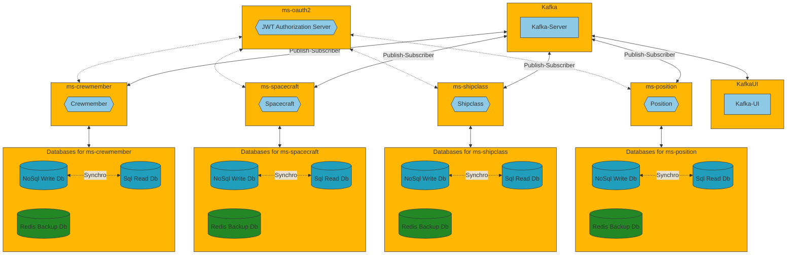

# reactive-solar-fleet

Manage your solar space fleet with this project. It is a combination of REST API and Reactive Programming in a multimodule Maven project with Hexagonal Arch, CQRS, Event Sourcing, and Kafka for synchronizing databases. Besides I have used Redis to save relevant information from other components.

**Components**
- [Kafka](https://kafka.apache.org/) [9092] + [9093] 
- [Kafka-UI](https://docs.kafka-ui.provectus.io/) [8080]
- REST API ms-position with [OpenApi Swagger](https://swagger.io/) and two separate DB for R/RW actions [8081]
- REST API ms-shipclass with [OpenApi Swagger](https://swagger.io/) and two separate DB for R/RW actions [8082]
- REST API ms-spacecraft with [OpenApi Swagger](https://swagger.io/) and two separate DB for R/RW actions [8083]
- REST API ms-crewmember with [OpenApi Swagger](https://swagger.io/) and two separate DB for R/RW actions [8084]
- REST API ms-oauth2 with [OpenApi Swagger](https://swagger.io/) working as JWT Token Authorization Server [9000]




## Table of contents

- [Installation](#installation)
- [Usage](#usage)
- [It's not a bug, it's a feature](#features)
- [Maintainers](#maintainers)
- [License](#license)


## Installation

1. First of all clone or download the project.

1. Inside the main folder, you could find two docker-compose yaml files.

1. From there use the command line to start the project in dev or production mode

```
    **Generate .jar**
    mvn clean package
    
    **Developer mode**  
    docker-compose -f docker-compose-dev.yml up -d

    **Production mode**
    docker-compose -f docker-compose-prod.yml up -d
```
      
The dev environment is ready for using with your IDE. The microservice attempts to communicate with Kafka using the local host. In production, it uses the archive Dockerfile to build an image of the project, so you wont need the IDE.
   
4. You could stop the project and free resources with any of these orders

```
    **Developer mode**
    docker-compose -f docker-compose-dev.yml down --rmi local -v
      
    **Production mode**
    docker-compose -f docker-compose-prod.yml down --rmi local -v  
```
  
   
## Usage

First of all, please visit the REST API documentation. Replace ${port} for the suitable microservice port:

    http://localhost:${port}/swagger-ui.html
    
[Kafka-UI](https://docs.kafka-ui.provectus.io/) allow you to check your [Kafka](https://kafka.apache.org/) server using a practical dashboard, so visit the following url:

    http://localhost:8080

The initial data load is performed by the kafka-data-init microservice. It uses Kafka to publish events, which the other microservices then use to update their databases.    

A good way for checking the JWT generation and validation flow, is to review **[this article](https://adictosaltrabajo.com/2023/06/29/securizacion-aplicacion-oauth-2-spring-authorization-server-spring-resource-server/)**. A key difference in my development is that you can register a user using the same microservice ms-oauth2 at **http://localhost:9000/register**. Here is an example of the info you need to send:

```
{
	"name":"Nico",	
	"lastname":"Macguffin",	
	"email":"nMacguffin@dom.eu",
	"password":"passpasspass"
}
```
On the other hand, the protected URL that requires JWT is waiting in the rest of microservices at http://localhost:{port}/actuator/metrics

## Features

#### :arrow_right: Unit testing for business logic classes using Test Containers for Repositories

#### :arrow_right: Hexagonal Architecture and CQRS with independent databases

#### :arrow_right: Redis DB for each microservice works as caches to store ID references for other REST APIs

#### :arrow_right: Event Sourcing for persisting as an ordered sequence of events

#### :arrow_right: General adoption of reactive programming 


## Maintainers

Just me, [Iván](https://github.com/Ivan-Montes) :sweat_smile:


## License

[GPLv3 license](https://choosealicense.com/licenses/gpl-3.0/)


---


[](https://www.java.com/es/)
[](https://https://maven.apache.org/)
[](https://spring.io)
[](https://github.com)
[](https://https://eclipse.org/)
[](https://www.sonarsource.com/products/sonarqube/downloads/)
[](https://www.docker.com/)
[](https://kafka.apache.org/)
[](https://choosealicense.com/licenses/gpl-3.0/)